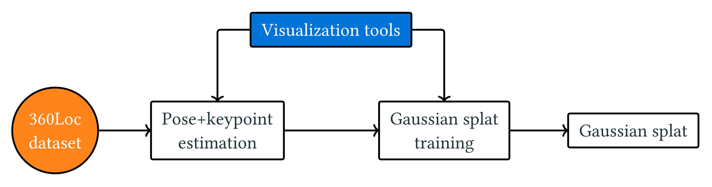

# Experiments with Gaussian splatting initialization methods
Evaluation of pose and keypoint estimation methods for the purpose of training Gaussian splats.
See the results section for all the rushed eye candy.

## Setup development enviroment
1. Download the [360Loc dataset](https://github.com/HuajianUP/360Loc)
2. Run the following in this repository
    ```bash
    git submodule update --init --recursive
    cp .env.example .env
    ```
3. Fill out the `.env` file
4. Open the project in a `devcontainer`
5. Done

## Run experiments
```bash
uv run src/splat_init/run_experiments.py
uv run investigations/metrics_analysis.py
```

## Results
Compile `investigations/presentation/main.typ` by viewing it in the devcontainer or via the `tinymist` extension for `vscode`.